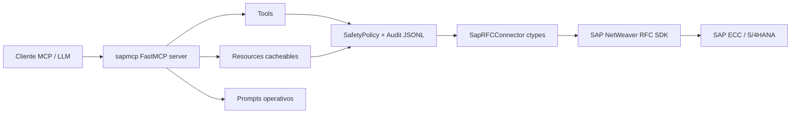

# sapmcp

**sapmcp** es un servidor MCP para operar y consultar sistemas **SAP ECC / SAP S/4HANA** mediante **SAP NetWeaver RFC SDK**, sin `pyrfc`, exponiendo tools, resources y prompts seguros para clientes LLM como Codex, Claude Desktop u otros hosts compatibles con MCP.

El proyecto está pensado para trabajo Basis/DevOps diario: conexión multi-sistema, llamadas RFC controladas, health checks, auditoría JSONL, resources cacheables y playbooks de operación en castellano.

> Estado actual: modo lectura por defecto, multi-destination, tools Basis, health check agregado y auditoría local.

---

## Índice

- [Qué resuelve](#qué-resuelve)
- [Arquitectura resumida](#arquitectura-resumida)
- [Requisitos](#requisitos)
- [Instalación rápida](#instalación-rápida)
- [Configurar un sistema SAP](#configurar-un-sistema-sap)
- [Añadir varios sistemas: DEV/QAS/PRD](#añadir-varios-sistemas-devqasprd)
- [Configurar usuarios y contraseñas](#configurar-usuarios-y-contraseñas)
- [Seguridad y modo lectura](#seguridad-y-modo-lectura)
- [Herramientas MCP](#herramientas-mcp)
- [Resources MCP](#resources-mcp)
- [Prompts MCP](#prompts-mcp)
- [Ejemplos de prompts de demo](#ejemplos-de-prompts-de-demo)
- [Health check](#health-check)
- [Auditoría](#auditoría)
- [Snapshot offline](#snapshot-offline)
- [Documentación adicional](#documentación-adicional)
- [Desarrollo y tests](#desarrollo-y-tests)

---

## Qué resuelve

Con `sapmcp`, un asistente LLM puede:

1. Validar conectividad RFC contra uno o varios sistemas SAP.
2. Ejecutar lecturas Basis frecuentes: dumps, syslog, locks, workprocesses, updates, colas RFC, jobs y auditoría de usuario.
3. Lanzar un `sap_health_check` con semáforo global `ok` / `warn` / `crit` / `unknown`.
4. Consultar resources cacheables como interfaces RFC, esquemas DDIC, sistema activo y destinos configurados.
5. Ejecutar RFCs genéricas bajo una política de seguridad explícita.
6. Registrar auditoría local sin contraseñas ni payload sensible.
7. Preparar demos reproducibles para Claude Desktop, Codex u otros hosts MCP, con prompts funcionales, Basis y ABAP.

El servidor **no incluye un LLM propio**. Expone capacidades MCP para que el LLM anfitrión las use.

---

## Arquitectura resumida



Módulos principales:

| Ruta | Función |
| --- | --- |
| `src/sapmcp/server.py` | Registro MCP de tools, resources y prompts. |
| `src/sapmcp/sap_rfc.py` | Bridge `ctypes` contra SAP NetWeaver RFC SDK. |
| `src/sapmcp/config.py` | Variables de entorno, destinos, librería SDK y SafetyPolicy. |
| `src/sapmcp/basis.py` | Tools Basis read-only. |
| `src/sapmcp/health.py` | `sap_health_check` agregado. |
| `src/sapmcp/resources.py` | Resources cacheables y namespace por destino. |
| `src/sapmcp/audit.py` | Auditoría JSONL. |
| `src/sapmcp/prompts.py` | Playbooks MCP en castellano. |

---

## Requisitos

### Software

- Python `>=3.10`.
- SAP NetWeaver RFC SDK instalado localmente.
- Acceso de red desde la máquina donde corre `sapmcp` al sistema SAP.
- Usuario SAP técnico con permisos RFC de lectura adecuados.

### SAP NetWeaver RFC SDK

SAP distribuye el SDK bajo licencia. No se incluye en el repositorio.

Debes tener disponible la librería nativa:

| Sistema operativo | Librería esperada |
| --- | --- |
| macOS | `libsapnwrfc.dylib` |
| Linux | `libsapnwrfc.so` |
| Windows | `sapnwrfc.dll` |

Ejemplos de rutas habituales:

```text
/usr/local/sap/nwrfcsdk/lib
/opt/sap/nwrfcsdk/lib
~/nwrfcsdk/lib
C:\nwrfcsdk\lib
```

---

## Instalación rápida

```bash
cd /Users/eduardoariasbravo/Developer/sapmcp
python3 -m venv .venv
source .venv/bin/activate
pip install -e .
cp .env.example .env
```

Si quieres usar keyring para no guardar passwords en `.env`:

```bash
pip install -e '.[keyring]'
```

En macOS/Linux puede hacer falta exportar la ruta del SDK antes de arrancar el servidor:

```bash
export DYLD_LIBRARY_PATH=/usr/local/sap/nwrfcsdk/lib:$DYLD_LIBRARY_PATH  # macOS
export LD_LIBRARY_PATH=/usr/local/sap/nwrfcsdk/lib:$LD_LIBRARY_PATH      # Linux
```

Arranque local:

```bash
source .venv/bin/activate
sapmcp
```

O directamente:

```bash
python -m sapmcp.server
```

---

## Configurar un sistema SAP

La configuración base usa variables clásicas `SAP_*`. Este bloque define el destino lógico `default` y preserva compatibilidad con despliegues previos.

```env
SAP_ASHOST=host.sap.local
SAP_SYSNR=00
SAP_CLIENT=100
SAP_USER=RFC_USER
SAP_PASS=********
SAP_LANG=ES
SAP_NWRFC_LIB_DIR=/usr/local/sap/nwrfcsdk/lib
```

Alternativa con message server / logon group:

```env
SAP_MSHOST=message-server.sap.local
SAP_R3NAME=S4D
SAP_GROUP=PUBLIC
SAP_CLIENT=100
SAP_USER=RFC_USER
SAP_PASS=********
SAP_LANG=ES
```

SAProuter, si aplica:

```env
SAP_SAPROUTER=/H/router.example.local/H/
```

SNC, si aplica:

```env
SAP_SNC_MODE=1
SAP_SNC_LIB=/path/to/libsapcrypto.dylib
SAP_SNC_QOP=8
SAP_SNC_MYNAME=p:CN=client, OU=...
SAP_SNC_PARTNERNAME=p:CN=server, OU=...
```

---

## Añadir varios sistemas: DEV/QAS/PRD

`sapmcp` soporta múltiples destinos nombrados. Cada tool que abre conexión SAP acepta `destination` opcional.

```env
SAPMCP_DESTINATIONS=DEV,QAS,PRD
SAPMCP_DEFAULT_DESTINATION=DEV
```

Ejemplo completo:

```env
# Destino clásico retrocompatible: default
SAP_ASHOST=classic.sap.local
SAP_SYSNR=00
SAP_CLIENT=100
SAP_USER=RFC_CLASSIC
SAP_PASS=********
SAP_LANG=ES

# Destino DEV
SAP_DEV_ASHOST=dev.sap.local
SAP_DEV_SYSNR=01
SAP_DEV_CLIENT=110
SAP_DEV_USER=RFC_DEV
SAP_DEV_PASS=********
SAP_DEV_LANG=ES

# Destino QAS
SAP_QAS_ASHOST=qas.sap.local
SAP_QAS_SYSNR=02
SAP_QAS_CLIENT=120
SAP_QAS_USER=RFC_QAS
SAP_QAS_PASS=********
SAP_QAS_LANG=ES

# Destino PRD vía message server
SAP_PRD_MSHOST=msg-prd.sap.local
SAP_PRD_R3NAME=PRD
SAP_PRD_GROUP=PUBLIC
SAP_PRD_CLIENT=100
SAP_PRD_USER=RFC_PRD
SAP_PRD_PASS=********
SAP_PRD_LANG=ES
```

Uso desde MCP:

```json
{
  "tool": "sap_health_check",
  "arguments": {"destination": "QAS", "profile": "standard"}
}
```

Si omites `destination`, se usa:

1. `SAPMCP_DEFAULT_DESTINATION`, si está definido.
2. Si no, el destino clásico `default` con variables `SAP_*`.

---

## Configurar usuarios y contraseñas

### Usuario SAP técnico recomendado

Crea en SAP un usuario técnico RFC por entorno, por ejemplo:

| Entorno | Usuario sugerido |
| --- | --- |
| DEV | `RFC_SAPMCP_DEV` |
| QAS | `RFC_SAPMCP_QAS` |
| PRD | `RFC_SAPMCP_PRD` |

Recomendaciones:

- Tipo de usuario: técnico/comunicación según política interna.
- No usar usuarios personales para operación diaria automatizada.
- Dar solo permisos read-only necesarios.
- Separar usuarios por entorno.
- En PRD, aplicar autorización más restrictiva y registrar responsable.

Permisos típicos a coordinar con Basis/Security:

- `S_RFC` para RFCs/BAPIs usadas.
- Permisos de lectura DDIC/tablas para `RFC_READ_TABLE` cuando proceda.
- Permisos XBP para `BAPI_XBP_JOB_SELECT` si se usan jobs.
- Permisos de administración/monitorización necesarios para `TH_*`, syslog, enqueue, dumps, updates, según release y política.

### Opción 1: passwords en `.env`

```env
SAP_DEV_USER=RFC_SAPMCP_DEV
SAP_DEV_PASS=********
```

### Opción 2: keyring local

Instala el extra:

```bash
pip install -e '.[keyring]'
```

Guarda password genérica para el usuario clásico:

```bash
export SAP_USER=RFC_USER
sapmcp-credentials set
```

Activa keyring:

```env
SAPMCP_USE_KEYRING=true
```

Para destinos nombrados, el código busca primero `service="sapmcp"`, `user="DESTINO:USUARIO"`, y si no existe cae a `user="USUARIO"`.

Ejemplo para guardar una password específica de DEV:

```bash
python - <<'PY'
import getpass
import keyring
keyring.set_password("sapmcp", "DEV:RFC_SAPMCP_DEV", getpass.getpass("Password DEV: "))
PY
```

---

## Seguridad y modo lectura

Por defecto, `sapmcp` arranca en modo conservador:

```env
SAPMCP_READ_ONLY=true
SAPMCP_ALLOWED_RFC=
SAPMCP_ALLOW_DANGEROUS=false
SAPMCP_MAX_ROWS=200
SAPMCP_RFC_TIMEOUT=60
```

Comportamiento:

- RFCs conocidas como lectura se permiten.
- RFCs con nombres peligrosos (`*CREATE*`, `*CHANGE*`, `*DELETE*`, `*UPDATE*`, `*POST*`, etc.) se bloquean salvo confirmación doble.
- `RFC_READ_TABLE` se limita con `SAPMCP_MAX_ROWS`.
- `SAPMCP_RFC_TIMEOUT` controla el timeout de `RfcInvoke`.

Allowlist opcional:

```env
SAPMCP_ALLOWED_RFC=RFC_PING,STFC_CONNECTION,RFC_READ_TABLE,RFC_GET_*,BAPI_*_GET*,Z_MI_RFC_LECTURA
```

Para cambios reales —no recomendado salvo entorno controlado— se exige:

```env
SAPMCP_READ_ONLY=false
SAPMCP_ALLOW_DANGEROUS=true
```

y además la tool debe pasar `confirm_dangerous=true`.

---

## Herramientas MCP

### Sistema y configuración

| Tool | Uso |
| --- | --- |
| `sap_config_status(destination=None)` | Configuración activa sanitizada y destinos disponibles. |
| `sap_safety_check(function_name)` | Clasifica una RFC frente a la política de seguridad. |
| `sap_resources_invalidate(prefix=None)` | Limpia cache de resources. |
| `sap_audit_tail(n=50)` | Lee las últimas entradas de auditoría del día. |
| `sap_catalog_search(kind, pattern)` | Busca en snapshot offline sin tocar SAP. |
| `sap_prompt_protocol(prompt)` | Protocolo genérico para traducir una petición humana a pasos SAP seguros. |

### RFC genéricas

| Tool | Uso |
| --- | --- |
| `sap_ping(destination=None)` | Prueba `RFC_PING`. |
| `sap_describe_rfc(function_name, destination=None)` | Describe interfaz con `RFC_GET_FUNCTION_INTERFACE`. |
| `sap_read_table(table_name, fields=None, where=None, rowcount=None, ..., destination=None)` | Lee tabla/vista vía `RFC_READ_TABLE`. |
| `sap_rfc_call(function_name, ..., destination=None)` | Llamada RFC genérica con import params, tablas y salidas explícitas. |
| `sap_search_rfc(prefix, limit=50, destination=None)` | Busca módulos RFC por prefijo en `TFDIR`. |

### Operación Basis

| Tool | Transacción mental | Uso |
| --- | --- | --- |
| `sap_get_short_dumps(date_from=None, date_to=None, user=None, destination=None)` | ST22 | Dumps ABAP por fecha/usuario. |
| `sap_get_syslog(date_from=None, date_to=None, severity=None, destination=None)` | SM21 | Syslog con fallback de RFC estándar. |
| `sap_get_locks(table=None, user=None, destination=None)` | SM12 | Locks activos. |
| `sap_get_workprocesses(server=None, destination=None)` | SM50/SM66 | Workprocesses por servidor o todos. |
| `sap_get_update_requests(status=None, user=None, destination=None)` | SM13 | Updates pendientes/erróneos. |
| `sap_get_rfc_queue(queue_type="trfc", destination=None)` | SM58/qRFC | tRFC, qRFC out, qRFC in. |
| `sap_get_jobs(top_n=50, status=None, since_days=1, destination=None)` | SM37 | Jobs por estado y ventana. |
| `sap_get_user_audit(user, destination=None)` | SU01/SUIM | Perfiles, roles, bloqueo, vigencia, SAP_ALL y fallos de logon. |

### Health check

| Tool | Uso |
| --- | --- |
| `sap_health_check(destination=None, profile="standard")` | Dashboard JSON con semáforo y métricas agregadas. |

---

## Resources MCP

Resources cacheables. Admiten URI legacy y URI con destino.

| URI | TTL | Uso |
| --- | ---: | --- |
| `sap://destinations` | infinito | Lista destinos configurados, sin contraseñas ni rutas SDK. |
| `sap://system/info` | 60s | Info del destino por defecto. |
| `sap://{destination}/system/info` | 60s | Ping funcional `STFC_CONNECTION` + SAP params sanitizados. |
| `sap://policy/allowlist` | infinito | Política de seguridad activa. |
| `sap://{destination}/policy/allowlist` | infinito | Política namespaced por destino. |
| `sap://function/{name}/interface` | 600s | Interfaz RFC cacheada. |
| `sap://{destination}/function/{name}/interface` | 600s | Interfaz RFC por destino. |
| `sap://table/{name}/schema` | 600s | Esquema DDIC. |
| `sap://{destination}/table/{name}/schema` | 600s | Esquema DDIC por destino. |
| `sap://catalog/rfc?prefix=...` | 300s | Catálogo RFC por prefijo. |
| `sap://{destination}/catalog/rfc?prefix=...` | 300s | Catálogo RFC por destino. |
| `sap://catalog/snapshot` | archivo | Snapshot offline local. |

Ejemplos:

```text
read_resource("sap://destinations")
read_resource("sap://DEV/system/info")
read_resource("sap://QAS/function/BAPI_USER_GET_DETAIL/interface")
read_resource("sap://DEV/table/T000/schema")
```

---

## Prompts MCP

Los prompts son playbooks; no ejecutan acciones por sí mismos.

| Prompt | Uso |
| --- | --- |
| `basis_triage_sistema` | Triage inicial de sistema. |
| `inspeccionar_pedido_venta` | Inspección read-only de pedido SD. |
| `seguimiento_idoc` | Seguimiento read-only de IDoc. |
| `revisar_jobs_largos` | Revisión de jobs largos. |
| `informe_sociedad` | Informe financiero básico por sociedad/ejercicio. |
| `pre_change_check` | Checklist humano antes de cualquier RFC peligrosa. |
| `health_check_response` | Redacta en español una respuesta humana a partir del JSON de `sap_health_check`. |

---

## Ejemplos de prompts de demo

El repositorio incluye una guía oficial de prompts listos para copiar y pegar:

- [`docs/ejemplos-prompts.md`](docs/ejemplos-prompts.md) — prompts endurecidos para demos funcionales, Basis, ABAP y management.

La guía está pensada para demostrar en directo la propuesta de valor de `sapmcp`:

- SAP como interfaz conversacional mediante MCP.
- Operación segura en modo `SAPMCP_READ_ONLY=true`.
- Cruce de tablas y RFCs estándar sin depender de `pyrfc`.
- Preflight, fallbacks y límites de lectura para evitar demos frágiles.

---

## Health check

`sap_health_check` orquesta varias lecturas Basis. En perfiles `standard` y `deep`, usa paralelización con `ThreadPoolExecutor(max_workers=4)`, pero **cada check abre su propia conexión RFC**.

| Perfil | Tope global | Checks |
| --- | ---: | --- |
| `quick` | 2s | Ping, locks, workprocesses básicos. |
| `standard` | 15s | `quick` + dumps 24h, updates, tRFC, jobs cancelados 24h. |
| `deep` | 45s | `standard` + usuarios activos, T000, servidores, muestra SNAP/syslog si autorizado. |

Umbrales por defecto:

| Check | Warn | Crit | Variables |
| --- | ---: | ---: | --- |
| dumps 24h | 5 | 20 | `SAPMCP_HC_DUMPS_WARN`, `SAPMCP_HC_DUMPS_CRIT` |
| locks total | 50 | 200 | `SAPMCP_HC_LOCKS_WARN`, `SAPMCP_HC_LOCKS_CRIT` |
| updates pendientes | 1 | 10 | `SAPMCP_HC_UPDATE_PENDING_WARN`, `SAPMCP_HC_UPDATE_PENDING_CRIT` |
| updates ERR | 1 | 1 | `SAPMCP_HC_UPDATE_ERR_WARN`, `SAPMCP_HC_UPDATE_ERR_CRIT` |
| tRFC pendiente | 20 | 100 | `SAPMCP_HC_TRFC_WARN`, `SAPMCP_HC_TRFC_CRIT` |
| jobs abortados 24h | 1 | 5 | `SAPMCP_HC_JOBS_ABORTED_WARN`, `SAPMCP_HC_JOBS_ABORTED_CRIT` |
| workprocess PRIV | 1 | 2 | `SAPMCP_HC_WP_PRIV_WARN`, `SAPMCP_HC_WP_PRIV_CRIT` |
| workprocess stopped | 1 | 1 | `SAPMCP_HC_WP_STOPPED_WARN`, `SAPMCP_HC_WP_STOPPED_CRIT` |

Ejemplo:

```json
{
  "tool": "sap_health_check",
  "arguments": {"destination": "DEV", "profile": "standard"}
}
```

Salida abreviada:

```json
{
  "destination": "DEV",
  "sid": "S4D",
  "mandt": "100",
  "profile": "standard",
  "verdict": "warn",
  "checks": [
    {"name": "ping", "status": "ok", "value": {"RESPTEXT": "ok"}, "threshold": null, "duration_ms": 42.1, "error": null},
    {"name": "jobs_aborted_24h", "status": "warn", "value": 1, "threshold": {"warn": 1, "crit": 5}, "duration_ms": 120.4, "error": null}
  ],
  "summary": "DEV: verdict=warn; crit=0, warn=1, unknown=0. Revisar: jobs_aborted_24h."
}
```

---

## Auditoría

Las tools que tocan SAP se auditan en JSONL:

```text
~/.sapmcp/audit-YYYYMMDD.jsonl
```

Cada línea incluye:

```text
ts, tool, function, destination, params_hash, rc, duration_ms,
sid, mandt, user, dangerous, confirmed, error_key, error_message
```

No se guarda payload completo ni contraseñas. `params_hash` se calcula sobre parámetros redactados.

Consulta desde MCP:

```json
{
  "tool": "sap_audit_tail",
  "arguments": {"n": 50}
}
```

---

## Snapshot offline

Puedes generar un catálogo local comprimido para búsquedas sin tocar SAP:

```bash
sapmcp-snapshot --page-size 500
```

Genera en `~/.sapmcp/` un fichero tipo:

```text
catalog-{SID}.json.gz
```

Búsqueda offline:

```json
{
  "tool": "sap_catalog_search",
  "arguments": {"kind": "rfc", "pattern": "BAPI_USER"}
}
```

---

## Configuración MCP en cliente

Ejemplo genérico:

```json
{
  "mcpServers": {
    "sapmcp": {
      "command": "/Users/eduardoariasbravo/Developer/sapmcp/.venv/bin/sapmcp",
      "cwd": "/Users/eduardoariasbravo/Developer/sapmcp"
    }
  }
}
```

Si el cliente no carga variables de entorno del shell, define `env` explícito o usa `.env` en el `cwd` del proyecto.

---

## Documentación adicional

- [`docs/operation.md`](docs/operation.md) — manual básico de instalación, configuración y operación desde cero.
- [`docs/architecture.md`](docs/architecture.md) — arquitectura técnica.
- [`docs/ejemplos-prompts.md`](docs/ejemplos-prompts.md) — ejemplos oficiales de prompts para demos con Claude/Codex y otros hosts MCP.
- [`docs/sapmcp-abap-docker-validation-2026-05-06.md`](docs/sapmcp-abap-docker-validation-2026-05-06.md) — validación contra ABAP Docker.
- [`docs/sapmcp-abap-docker-validation-fase8-20260506.md`](docs/sapmcp-abap-docker-validation-fase8-20260506.md) — validación ampliada de multi-destination, Basis, health check, SafetyPolicy y snapshot.

---

## Desarrollo y tests

Instalar editable:

```bash
source .venv/bin/activate
pip install -e .
```

Ejecutar tests:

```bash
pytest -q
# o
.venv/bin/pytest -q
```

Resultado esperado actual:

```text
35 passed
```
