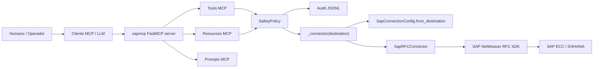

# Arquitectura técnica — sapmcp

`sapmcp` es un servidor MCP Python que conecta clientes LLM con SAP ECC/S/4HANA mediante SAP NetWeaver RFC SDK. La arquitectura prioriza lectura segura, auditoría y separación estricta entre destinos SAP.

---

## Diagrama lógico



---

## Capas

| Capa | Archivos | Responsabilidad |
| --- | --- | --- |
| MCP server | `server.py` | Registra tools, resources y prompts con FastMCP. |
| Configuración | `config.py` | Lee `.env`, resuelve destinos, SDK y SafetyPolicy. |
| Conexión RFC | `sap_rfc.py` | Bridge `ctypes` hacia SAP NetWeaver RFC SDK. |
| Tools genéricas | `server.py` | Ping, describe RFC, read table, RFC call, seguridad. |
| Tools Basis | `basis.py` | Operación diaria read-only: dumps, syslog, locks, WPs, updates, colas, jobs, usuario. |
| Health check | `health.py` | Dashboard agregado con umbrales y verdict global. |
| Resources | `resources.py` | Lecturas cacheables con TTL y namespace por destination. |
| Prompts | `prompts.py` | Playbooks en castellano para guiar al LLM. |
| Auditoría | `audit.py` | JSONL diario, redacción de secretos y hash de parámetros. |
| Snapshot | `snapshot.py` | Catálogo offline comprimido y búsqueda sin tocar SAP. |

---

## Multi-destination

La configuración de conexión se resuelve con:

```python
SapConnectionConfig.from_destination(name)
```

Reglas:

1. `name=None` usa `SAPMCP_DEFAULT_DESTINATION` si existe.
2. Si no existe default explícito, usa destino clásico `default`.
3. `default` lee variables `SAP_*` sin prefijo.
4. Destinos nombrados leen `SAP_{N}_*`.
5. `list_destinations()` devuelve `default` + `SAPMCP_DESTINATIONS`.

El helper de paquete:

```python
_connector(destination)
```

crea un `SapRFCConnector` con la configuración del destino solicitado.

---

## Seguridad

`SafetyPolicy` controla cada RFC antes de invocarla:

- `SAPMCP_READ_ONLY=true` por defecto.
- Patrones read-only conocidos.
- Patrones peligrosos bloqueados.
- Allowlist opcional `SAPMCP_ALLOWED_RFC`.
- Confirmación doble para cambios: `SAPMCP_ALLOW_DANGEROUS=true` + `confirm_dangerous=true`.

Las tools Basis y health check usan RFCs estándar de lectura. Si una RFC opcional no existe, devuelven `available=false` o check `unknown` en vez de romper el flujo.

---

## Cache de resources

`resources.py` mantiene cache en memoria:

```text
destination/{name}/...
```

Esto evita mezclar metadatos de DEV/QAS/PRD.

TTL principales:

| Resource | TTL |
| --- | ---: |
| system/info | 60s |
| function/interface | 600s |
| table/schema | 600s |
| catalog/rfc | 300s |
| policy/allowlist | infinito hasta invalidación |
| destinations | infinito hasta invalidación |

Invalidación:

```json
{"tool": "sap_resources_invalidate", "arguments": {"prefix": "function/BAPI_USER"}}
```

---

## Health check y concurrencia

`health.py` ejecuta checks con `ThreadPoolExecutor(max_workers=4)`.

Regla crítica:

> Nunca se comparte un `SapRFCConnector` ni un `connection_handle` entre threads.

Cada check abre/cierra su propia conexión. Si se excede el tope global del perfil, el check queda:

```json
{"status": "unknown", "error": "timeout"}
```

Verdict:

- `crit` si hay algún crítico.
- `warn` si hay warnings o unknown mezclados.
- `ok` solo si todo está verde.
- `unknown` si todo quedó unknown.

---

## Auditoría

Cada tool SAP-touching registra JSONL diario en:

```text
~/.sapmcp/audit-YYYYMMDD.jsonl
```

No se guarda payload completo ni passwords. Se guarda `params_hash` sobre parámetros redactados.

Campos clave:

```text
ts, tool, function, destination, params_hash, rc, duration_ms,
sid, mandt, user, dangerous, confirmed, error_key, error_message
```

---

## Dependencias

Dependencias Python directas:

- `mcp`
- `python-dotenv`
- `pydantic`
- `keyring` opcional mediante extra `sapmcp[keyring]`

Dependencia nativa obligatoria:

- SAP NetWeaver RFC SDK.

---

## Extender el proyecto

Para añadir una nueva tool read-only:

1. Implementarla en módulo específico o `basis.py`.
2. Aceptar `destination: str | None = None`.
3. Llamar `SafetyPolicy.assert_allowed()` para cada RFC.
4. Usar `_connector(destination)`; no compartir conexión global.
5. Decorar con `@audited("nombre_tool")`.
6. Registrar en `server.py` con `@mcp.tool()` o `mcp.tool()(func)`.
7. Añadir tests con SDK/conector fake.
8. Documentar en README y manual.

Para una RFC que puede cambiar datos, no asumir seguridad: requiere diseño específico, confirmación humana y revisión de permisos.
