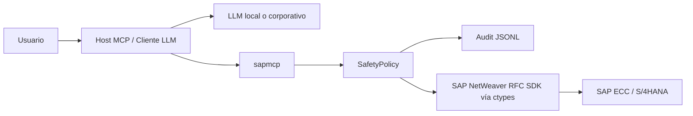

# Seguridad operativa y recomendaciones de modelos locales para sapmcp

**Audiencia:** equipos Basis/DevOps SAP, responsables de seguridad, arquitectos de integración, preventa técnica y usuarios que quieran ejecutar `sapmcp` con LLMs locales.

**Objetivo:** explicar por qué `sapmcp` debe tratarse como una integración sensible aunque opere en modo lectura, describir el modelo de seguridad del proyecto y recomendar modelos locales/open-weight adecuados para operar prompts SAP mediante MCP.

**Fecha de referencia:** mayo de 2026.

---

## 1. Principio fundamental: no usar LLMs públicos con datos SAP reales

Aunque `sapmcp` esté diseñado para operar por defecto en **modo lectura** y aunque sus tools no den por sí solas acceso directo a SAP GUI ni permitan cambios sin controles explícitos, **los datos que devuelve SAP siguen siendo datos corporativos sensibles**.

Una lectura aparentemente inocente puede exponer:

- clientes, proveedores, empleados o usuarios técnicos;
- saldos, facturas, pedidos, márgenes, sociedades y bancos;
- roles, perfiles, `SAP_ALL`, usuarios bloqueados o patrones de logon;
- nombres de programas, RFCs, objetos `Z*`, jobs, dumps y errores internos;
- arquitectura, hosts, mandantes, destinos RFC y señales de seguridad operacional.

Por tanto, para datos SAP reales o de cliente:

> **Recomendación fuerte:** no enviar prompts, resultados de tools ni trazas SAP a LLMs públicos o servicios externos no aprobados por seguridad corporativa.

Esto incluye prompts de demo si contienen datos reales. Un pedido de venta, un dump, un usuario con roles o un documento contable pueden ser información confidencial aunque se hayan obtenido solo con lecturas.

### Política recomendada por entorno

| Entorno | LLM recomendado | Comentario |
|---|---|---|
| Laboratorio sintético sin datos reales | LLM cloud o local | Apto para demos generales. |
| ABAP Docker / A4H con datos de prueba | Preferible local | Evitar compartir usuarios, dumps o configuración. |
| DEV/QAS de cliente | Local/on-prem o cloud privado aprobado | Requiere autorización de seguridad. |
| PRD | Local/on-prem, VPC privada o plataforma corporativa aprobada | Usuario técnico mínimo, auditoría y controles adicionales. |

---

## 2. Qué es `sapmcp` desde el punto de vista de seguridad

`sapmcp` es un servidor MCP que expone herramientas de lectura/operación SAP a un host LLM. No contiene un LLM propio. El host —Claude Desktop, Codex, LM Studio, Cursor u otro— decide cuándo llamar una tool MCP.

La arquitectura simplificada es:



La seguridad no depende de que el LLM "se porte bien". El diseño de `sapmcp` añade controles en el servidor:

1. **Modo lectura por defecto.**
2. **Clasificación de RFCs read-only y peligrosas.**
3. **Allowlist opcional de RFCs.**
4. **Doble confirmación para RFCs peligrosas.**
5. **Límite de filas para `RFC_READ_TABLE`.**
6. **Timeout de RFCs.**
7. **Auditoría JSONL sin contraseñas.**
8. **Configuración multi-destination explícita.**
9. **Redacción de secretos en configuración y logs.**

---

## 3. Configuración segura por defecto

El modo recomendado para demos, laboratorios y primeras conexiones es:

```env
SAPMCP_READ_ONLY=true
SAPMCP_ALLOWED_RFC=
SAPMCP_ALLOW_DANGEROUS=false
SAPMCP_MAX_ROWS=200
SAPMCP_RFC_TIMEOUT=60
```

### Qué significa cada variable

| Variable | Valor recomendado | Efecto |
|---|---:|---|
| `SAPMCP_READ_ONLY` | `true` | Bloquea RFCs no reconocidas como lectura salvo allowlist explícita. |
| `SAPMCP_ALLOWED_RFC` | vacío o lista mínima | Si se informa, solo permite RFCs que encajen con esa allowlist. |
| `SAPMCP_ALLOW_DANGEROUS` | `false` | Impide RFCs peligrosas incluso si el LLM las solicita. |
| `SAPMCP_MAX_ROWS` | `200` | Limita lecturas por `RFC_READ_TABLE`. |
| `SAPMCP_RFC_TIMEOUT` | `60` | Evita que una llamada RFC quede colgada indefinidamente. |

### RFCs conocidas como lectura

La `SafetyPolicy` permite patrones de lectura como:

```text
RFC_PING
STFC_CONNECTION
RFC_READ_TABLE
RFC_GET_SHORT_DUMP_LIST
RSLG_READ_SYSLOG
BAPI_SYSLOG_READ
ENQUEUE_READ
TH_WPINFO
TH_SERVER_LIST
TH_USER_LIST
BAPI_UPDREQUEST_GETLIST
BAPI_USER_LOCK_STATUS
BAPI_XBP_JOB_SELECT
RFC_GET_*
DDIF_*
BAPI_*_GET*
BAPI_*_DISPLAY*
BAPI_*_EXIST*
BAPI_*_SEARCH*
BAPI_*_LIST*
BAPI_USER_GET*
```

Esto permite triage Basis, exploración DDIC, búsqueda de RFCs, health checks y lecturas controladas.

### RFCs peligrosas bloqueadas

`sapmcp` marca como peligrosos nombres que encajan con patrones como:

```text
*COMMIT*
*ROLLBACK*
*CREATE*
*CHANGE*
*DELETE*
*UPDATE*
*POST*
*CANCEL*
*RELEASE*
RFC_ABAP_INSTALL_AND_RUN
RFC_REMOTE_PIPE
SXPG_*
```

Una RFC peligrosa no se ejecuta por accidente. Para desbloquearla habría que cumplir dos condiciones simultáneas:

```env
SAPMCP_READ_ONLY=false
SAPMCP_ALLOW_DANGEROUS=true
```

y además la llamada debe incluir:

```json
{"confirm_dangerous": true}
```

Para demos y uso consultivo, **no activar estos flags**.

---

## 4. Usuario SAP técnico recomendado

El usuario SAP usado por `sapmcp` debe seguir principio de mínimo privilegio.

### Recomendado

- Usuario técnico dedicado, por ejemplo `RFC_SAPMCP_DEV`.
- Un usuario distinto por entorno: DEV, QAS, PRD.
- Autorizaciones RFC de lectura acotadas.
- Acceso DDIC/tablas solo a lo necesario.
- Sin permisos de cambio en negocio.
- Sin `SAP_ALL` ni `SAP_NEW`.
- Password gestionado por keyring, vault o variables seguras.
- Auditoría activa en SAP y en `sapmcp`.

### No recomendado

- No usar `SAP*` salvo laboratorio muy controlado.
- No usar `DDIC` salvo caso excepcional de administración.
- No usar usuarios personales de consultores.
- No usar usuarios con `SAP_ALL` en demos comerciales.
- No compartir el mismo usuario entre DEV/QAS/PRD.
- No guardar passwords reales en documentación, screenshots, prompts o commits.

> Nota: en validaciones contra ABAP Docker/A4H puede aparecer `SAP*`/mandante `000` porque el entorno de laboratorio tiene restricciones de licencia. Esa excepción no debe trasladarse a sistemas de cliente.

---

## 5. Datos, prompts y auditoría

### No enviar secretos al LLM

El LLM no necesita ver:

- passwords;
- SNC secrets;
- rutas internas sensibles si no aportan valor;
- tokens;
- `.env` completo;
- dumps completos si contienen datos personales o comerciales.

`sapmcp` redacta configuración sensible en tools como `sap_config_status`, pero el operador también debe evitar copiar secretos en prompts.

### Auditoría local

Las tools que tocan SAP escriben auditoría JSONL local, típicamente en:

```text
~/.sapmcp/audit-YYYYMMDD.jsonl
```

La auditoría contiene metadatos como:

```text
ts, tool, function, destination, params_hash, rc, duration_ms,
sid, mandt, user, dangerous, confirmed, error_key, error_message
```

No se guarda payload completo ni contraseñas. Esto permite demostrar trazabilidad sin convertir la auditoría en un repositorio de datos SAP.

### `RFC_READ_TABLE` y límites

`RFC_READ_TABLE` es útil para exploración, pero debe tratarse con cuidado:

- usar campos concretos;
- usar `where` restrictivo;
- respetar `SAPMCP_MAX_ROWS`;
- evitar tablas enormes/ancha sin filtros;
- recordar el límite clásico de `DATA-WA` de 512 bytes;
- para producción, preferir BAPIs estándar o Z-RFCs de lectura bien diseñadas.

---

## 6. Recomendación sobre LLMs locales

Para datos SAP reales, la opción preferente es ejecutar el LLM en:

- LM Studio local;
- Ollama local;
- llama.cpp local;
- vLLM/SGLang en infraestructura propia;
- servidor corporativo on-prem;
- VPC privada aprobada por seguridad.

El modelo no necesita "saber SAP" perfectamente. Necesita principalmente:

1. buen tool calling/function calling;
2. seguimiento estricto de instrucciones;
3. capacidad de leer JSON/tablas;
4. razonamiento multi-paso;
5. ventana de contexto suficiente;
6. baja tendencia a inventar datos.

En `sapmcp`, muchos prompts se reducen a elegir herramientas y cruzar resultados, no a ejecutar SAP internamente.

---

## 7. Modelos locales/open-weight recomendados

La siguiente lista está orientada a operar `sapmcp` desde LM Studio, Ollama, llama.cpp, vLLM, SGLang u hosts MCP compatibles. La disponibilidad exacta en cada app cambia con el tiempo, por lo que conviene verificar el formato GGUF/MLX/Safetensors y el soporte de tool calling del runtime.

### 7.1 Qwen3-Coder-30B-A3B-Instruct

**Recomendación:** primera opción a probar para demos técnicas.

Motivos:

- Modelo MoE de 30.5B parámetros totales y 3.3B activos.
- Contexto nativo de 262K tokens.
- Orientado a agentic coding.
- La model card indica soporte para plataformas como Qwen Code/CLINE y tool calling.
- Ejecutable con vLLM, SGLang, llama.cpp, Ollama, LM Studio u otras apps compatibles según quant disponible.

Fuente: [Qwen/Qwen3-Coder-30B-A3B-Instruct](https://huggingface.co/Qwen/Qwen3-Coder-30B-A3B-Instruct)

Uso ideal con `sapmcp`:

- triage Basis;
- reverse engineering de RFCs;
- generación de borradores ABAP;
- lectura de JSON de tools;
- workflows técnicos largos.

### 7.2 Qwen3-32B

**Recomendación:** excelente opción general para preguntas funcionales y análisis SAP.

Motivos:

- 32.8B parámetros.
- Contexto nativo de 32K y ampliable con YaRN.
- Qwen destaca mejoras en razonamiento, seguimiento de instrucciones, multilingüe y capacidades agentic.
- La model card muestra uso agentic con MCP a través de Qwen-Agent.

Fuente: [Qwen/Qwen3-32B](https://huggingface.co/Qwen/Qwen3-32B)

Uso ideal con `sapmcp`:

- cliente 360;
- pedido que no factura;
- recorrido pedido → entrega → factura → FI;
- preguntas CFO;
- prompts en castellano.

### 7.3 Llama 3.1 / 3.3 70B Instruct

**Recomendación:** opción de alta fiabilidad si hay hardware suficiente.

Motivos:

- La model card de Llama 3.1 documenta tool use con Transformers.
- Reporta benchmarks de tool use para 70B Instruct: API-Bank 90.0 y BFCL 84.8.
- Buen razonamiento general y contexto amplio.

Fuente: [meta-llama/Llama-3.1-70B-Instruct](https://huggingface.co/meta-llama/Llama-3.1-70B-Instruct)

Uso ideal con `sapmcp`:

- demos importantes;
- preguntas menos guiadas;
- análisis multi-tabla;
- explicación ejecutiva a negocio.

### 7.4 Mistral Small 4

**Recomendación:** candidato moderno para tool calling con contexto largo si el runtime lo soporta bien.

Motivos:

- Modelo híbrido/MoE con 119B parámetros y 6.5B activos.
- Contexto de 256K.
- La ficha oficial lista function calling, agents/conversations, built-in tools y structured outputs.

Fuente: [Mistral Small 4 model card](https://docs.mistral.ai/models/model-cards/mistral-small-4-0-26-03)

Uso ideal con `sapmcp`:

- prompts largos;
- salidas estructuradas;
- análisis funcional/Basis con contexto amplio.

### 7.5 Gemma 3 27B

**Recomendación:** opción local razonable para prompts guiados y demos de complejidad media.

Motivos:

- 27B parámetros.
- Contexto de 128K.
- Google documenta soporte multilingüe y function calling para Gemma 3.

Fuentes:

- [Gemma 3 model card](https://ai.google.dev/gemma/docs/core/model_card_3)
- [Gemma 3 overview](https://ai.google.dev/gemma/docs/core)

Uso ideal con `sapmcp`:

- health checks;
- lecturas guiadas;
- prompts con pasos explícitos;
- demos internas.

### 7.6 Hermes 2 Pro / Hermes 3 / Hermes 4

**Recomendación:** interesantes cuando el stack local soporta bien el formato Hermes de tool calls.

Motivos:

- Hermes Pro fue entrenado explícitamente para function calling y JSON estructurado.
- Usa etiquetas como `<tool_call>` y `<tool_response>` para facilitar parseo.
- Variantes grandes pueden ser muy útiles para agentes locales.

Fuente: [NousResearch/Hermes-2-Pro-Llama-3-70B](https://huggingface.co/NousResearch/Hermes-2-Pro-Llama-3-70B)

Uso ideal con `sapmcp`:

- tool calling estructurado;
- salidas JSON;
- agentes locales con parsers específicos.

---

## 8. Matriz rápida de elección

| Nivel | Tamaño/modelos | Qué esperar con sapmcp |
|---|---|---|
| Básico | 8B-14B buenos | `sap_ping`, `sap_health_check`, lecturas simples, prompts muy guiados. |
| Serio | 27B-32B | Demos funcionales/Basis con prompts oficiales y datos reales. |
| Muy bueno | 70B | Preguntas libres, cruces complejos, análisis CFO, ABAP impacto. |
| Excelente | MoE grande / 70B+ | Operativa más autónoma y menos guiada. |

Orden práctico sugerido:

1. `Qwen3-Coder-30B-A3B-Instruct`
2. `Qwen3-32B`
3. `Llama 3.1/3.3 70B Instruct`
4. `Mistral Small 4`
5. `Gemma 3 27B`
6. `Hermes` tool-calling variants

---

## 9. Cómo ayudar a modelos locales más pequeños

La mejor forma de hacer que modelos más modestos funcionen bien no es pedirles que "sepan SAP", sino reducirles el espacio de decisión.

### 9.1 Tools de dominio más alto

En vez de obligar al modelo a decidir `VBAK`, `VBAP`, `VBFA`, `LIKP`, `LIPS`, `VBRK`, `BKPF`, etc., se pueden crear tools especializadas:

```text
sap_find_demo_objects()
sap_sd_document_flow(vbeln)
sap_customer_360(kunnr, bukrs)
sap_material_360(matnr)
sap_basis_landing_report()
sap_user_decommission_check(user)
sap_fi_top_documents(period)
```

Esto permite que un modelo 14B/27B llame una tool de negocio y se concentre en explicar el resultado.

### 9.2 Resources tipo chuleta SAP

Se pueden añadir resources MCP de referencia:

```text
sap://cheatsheets/sd-flow
sap://cheatsheets/fi-ar-ap
sap://cheatsheets/mm-material
sap://cheatsheets/basis-triage
sap://cheatsheets/abap-impact
sap://security/model
sap://local-models/recommendations
```

Un modelo local puede leer la chuleta antes de actuar, reduciendo errores.

### 9.3 Prompts MCP nativos

Los prompts de `docs/ejemplos-prompts.md` pueden convertirse a prompts MCP nativos en `src/sapmcp/prompts.py`, por ejemplo:

```text
demo_pedido_no_factura
demo_cliente_360
demo_sistema_lento
demo_reverse_rfc
demo_cfo_cobros
```

Esto ayuda porque el host MCP entrega el playbook como plantilla estructurada y no como texto improvisado.

### 9.4 Salidas estructuradas

Los modelos locales suelen rendir mejor si se les pide una salida rígida:

```json
{
  "veredicto": "...",
  "evidencias": [],
  "tools_usadas": [],
  "limitaciones": [],
  "siguiente_paso": "..."
}
```

### 9.5 Planes de ejecución predefinidos

Ejemplo para SD:

```text
1. Leer VBAK.
2. Leer VBAP.
3. Leer VBFA.
4. Si hay entrega, leer LIKP/LIPS.
5. Si hay factura, leer VBRK/VBRP.
6. Si hay documento contable, leer BKPF.
7. Resumir estado y bloqueo probable.
```

Cuanto más procedural sea el playbook, menos capacidad general necesita el modelo.

---

## 10. Configuración recomendada en LM Studio

Ejemplo conceptual de `mcp.json`:

```json
{
  "mcpServers": {
    "sapmcp": {
      "command": "/Users/eduardoariasbravo/Developer/sapmcp/.venv/bin/sapmcp",
      "args": [],
      "cwd": "/Users/eduardoariasbravo/Developer/sapmcp",
      "env": {
        "SAPMCP_READ_ONLY": "true",
        "SAPMCP_ALLOW_DANGEROUS": "false",
        "SAPMCP_MAX_ROWS": "200"
      }
    }
  }
}
```

Si LM Studio no carga variables desde `.env`, declarar también las variables SAP necesarias en `env` o asegurar que el `cwd` contiene `.env` y que la app lo respeta.

### Parámetros de generación sugeridos

Para tool calling, priorizar estabilidad sobre creatividad:

| Parámetro | Recomendación |
|---|---:|
| Temperature | 0.1-0.4 para demos críticas; usar recomendación específica del modelo si existe. |
| Top-p | 0.8-0.95 |
| Context | Lo máximo que permita el hardware sin paginar excesivamente. |
| Max output | Suficiente para JSON/tool traces, pero no enorme si no hace falta. |
| Modo thinking | Activar para análisis; desactivar si rompe tool calling en el runtime concreto. |

---

## 11. Checklist de seguridad antes de una demo

- [ ] Usar `SAPMCP_READ_ONLY=true`.
- [ ] Usar `SAPMCP_ALLOW_DANGEROUS=false`.
- [ ] Definir `SAPMCP_MAX_ROWS` razonable.
- [ ] Probar `sap_config_status` y revisar que no expone secretos.
- [ ] Probar `sap_ping`.
- [ ] Ejecutar `sap_health_check(profile="quick")`.
- [ ] Usar usuario técnico dedicado, no `SAP*`, no `DDIC`, no personal.
- [ ] No usar `SAP_ALL` salvo laboratorio controlado.
- [ ] No conectar LLM público a SAP real o datos de cliente.
- [ ] Preseleccionar objetos reales pero no sensibles.
- [ ] Verificar que la auditoría JSONL se genera.
- [ ] No mostrar pantallas con passwords, `.env`, tokens o rutas sensibles.
- [ ] Explicar al público que el modo demo es read-only y auditado.

---

## 12. Mensaje recomendado para clientes o seguridad

```text
sapmcp se ejecuta en modo lectura por defecto, con allowlist de RFCs, bloqueo de patrones peligrosos, límite de filas, timeout y auditoría local. Aun así, los datos SAP devueltos por las tools pueden contener información sensible; por eso, para sistemas reales recomendamos usar LLMs locales, on-prem o plataformas cloud privadas aprobadas, nunca LLMs públicos no autorizados.
```

```text
El LLM no recibe credenciales SAP ni ejecuta cambios por sí mismo. El servidor sapmcp aplica SafetyPolicy antes de cada RFC, audita las llamadas y bloquea operaciones de cambio salvo configuración deliberada y confirmación explícita.
```

---

## 13. Conclusión

`sapmcp` permite demostrar una potencia enorme: SAP consultable en lenguaje natural, sin `pyrfc`, mediante MCP y SAP NetWeaver RFC SDK vía `ctypes`. Pero esa potencia debe tratarse como una integración sensible.

La combinación recomendada para uso real es:

1. `sapmcp` en modo read-only.
2. Usuario SAP técnico de mínimo privilegio.
3. LLM local o infraestructura corporativa aprobada.
4. Prompts oficiales y playbooks guiados.
5. Auditoría activa.
6. Tools de dominio para reducir errores en modelos pequeños.

Con esa arquitectura, incluso modelos locales de 27B-32B pueden operar demos SAP útiles y modelos de 70B pueden acercarse a una experiencia de consultor asistido muy potente.
